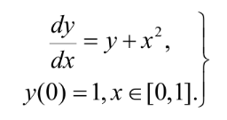

# Метод Адамса
Интерполяционная разностная схема Адамса 4 порядка для решения задачи Коши, заданной для
обыкновенного дифференциального уравнения первого порядка.

<p align="center">
  
</p>

## Ход решения
Вычисление значений происходит в два этапа:
1. Экстраполяция по формуле Адамса 4 порядка на следующее значение.
2. Корректировка полученного значения с помощью интерполяционного многочлена Адамса.

Метод сходится со скоростью О(h^4), о чем свидетельствует изменение ошибки при изменении шага.
Для сравнения метода был также реализован классический метод Эйлера, который дает результаты хуже и сходится с O(h).

## Запуск кода
Находясь в текущей папке, ввести в терминал:
```commandline
python3 src/main.py
```

## Пример работы

<p align="center">
  
</p>


