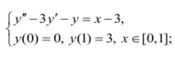

# Метод Бубнова — Галёркина

Построение конечномерного приближения к решению краевой задачи для 
дифференциального уравнения второго порядка, представленного ниже:
    
<p align="center">
  
</p>

## Ход решения
Решение представлено в виде разложения по базисным функциям, 
умноженным на соответствующие веса.


## Запуск кода
Находясь в текущей папке, ввести в терминал:
```commandline
python3 src/main.py
```

## Пример работы


