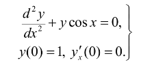

# Метод Рунге-Кутты

Трехстадийный метод Рунге-Кутты третьего порядка точности для решения задачи Коши, заданной 
для дифференциального уравнения второго порядка:
    
<p align="center">
  
</p>

## Ход решения
Дифференциальное уравнение второго порядка сведено к системе двух уравнений первого порядка,
после чего к ней применен метод Хойна с помощью соответствующей таблицы Бутчера.


## Запуск кода
Находясь в текущей папке, ввести в терминал:
```commandline
python3 src/main.py data/data.csv
```